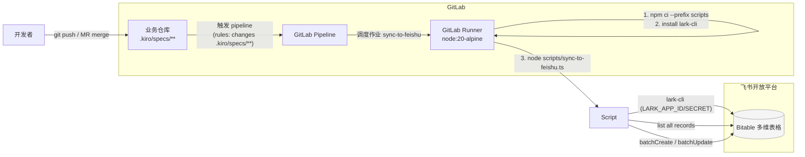
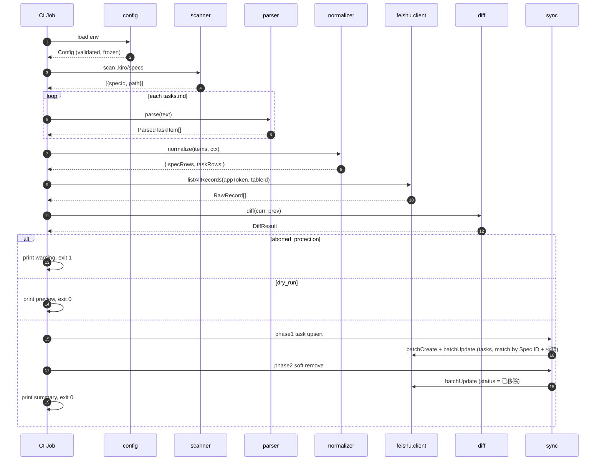
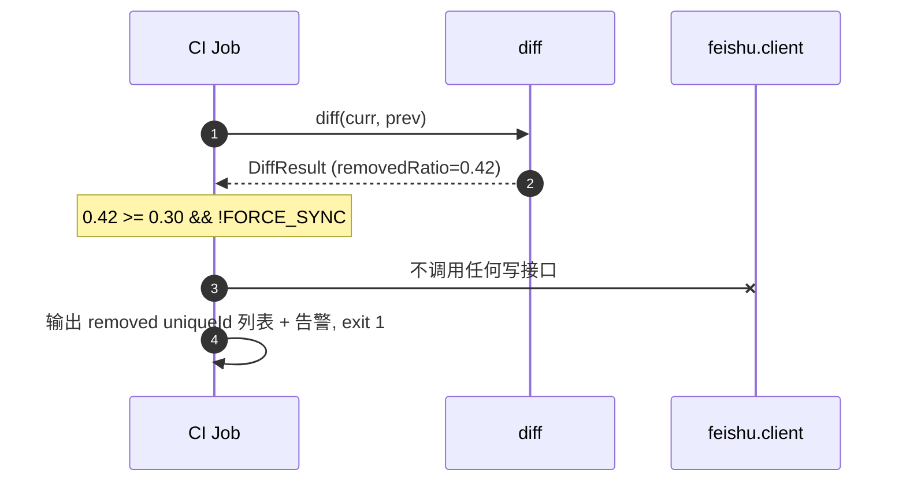

# 设计文档

## Overview

本设计为 [requirements.md](./requirements.md) 提供具体实现方案。核心思路：

- **触发**：脚本同时支持两种入口（参见 Req 1）：
  - **CI_Mode**：GitLab Pipeline（push 到默认分支 / MR merge / 手动触发）。
  - **Local_CLI_Mode**：开发者直接执行 `tsx scripts/sync-to-feishu.ts`，可通过 `REPO_ROOT` 指向任意外部仓库（如目标项目 `~/Documents/project/sproboagent`）。
- **执行**：仓库内 `scripts/sync-to-feishu.ts`（Node.js + TypeScript + `lark-cli`）。
- **目标**：单张飞书多维表格（Bitable），仅写入 Task_Row（每个 TopLevel_Task 一条记录），无父子层级。
- **状态域**：任务状态四值 `not_started` / `in_progress` / `done` / `removed`，分别对应飞书「未开始」/「进行中」/「已完成」/「已移除」单选选项；List_Task `[-]` 为 `in_progress`；Heading_Task 在子项混合或含 `[-]` 时也为 `in_progress`（参见 Req 2.6 / 2.7 / 2.12）。
- **状态**：飞书表本身即权威状态来源；脚本是无状态的，每次跑全量扫描 + diff + upsert。
- **CSV 诊断**：`CSV_OUTPUT_PATH` 设置时额外落盘一份 CSV 快照（参见 Req 12），用于本地解析正确性排查；不影响飞书写入逻辑。
- **安全闸门**：移除保护阈值（默认 30%）+ Dry-Run 模式，确保不会因脚本失误或仓库内容异常导致飞书表大面积失真。
- **可观测性**：完全依赖 GitLab CI 自带的 Job 日志与失败通知，不引入额外日志系统。

## Architecture

### 端到端流程



### Job 内执行管线

```mermaid
flowchart TB
  A[加载环境变量\n校验必填项] --> B[扫描 .kiro/specs/**\n排除 _* / .* / 散文件 / 无 tasks.md 目录\n收集 ignored entries]
  B --> C[解析每个 tasks.md\n→ ParsedTaskItem[]]
  C --> N1[读取 requirements.md\n推导 specTitle]
  N1 --> D[归一化\n→ SpecRow + TaskRow]
  D --> CSV{CSV_OUTPUT_PATH 已设置?}
  CSV -- "是" --> CW[写出 CSV 快照\n失败仅 WARN]
  CSV -- "否" --> E
  CW --> E[拉取飞书表全部现有记录]
  E --> F[计算 diff\ncreated / updated / removed / unchanged]
  F --> G{removedRatio\n>= 阈值?}
  G -- "是 && !FORCE_SYNC" --> X1[输出告警\n退出码 1]
  G -- "否" --> H{DRY_RUN?}
  H -- "是" --> X2[输出预览\n退出码 0]
  H -- "否" --> I[batchCreate SpecRow]
  I --> J[batchCreate/Update TaskRow\n带父记录关联]
  J --> K[batchUpdate 软移除]
  K --> L{有失败?}
  L -- "是" --> X3[输出失败摘要\n退出码 1]
  L -- "否" --> X4[输出成功摘要\n退出码 0]
```

## Components and Interfaces

模块路径与职责，按交付物组织。

### `scripts/sync-to-feishu.ts`（入口）

- 单文件入口，串联下文各 module。
- 顶层 `try/catch` 把任何未捕获异常转为 stderr 输出 + 非零退出码。
- 入口签名：`async function main(env: NodeJS.ProcessEnv): Promise<number>`，返回退出码（0 / 1）。

### `scripts/src/config.ts`

- 用 `zod` 校验 `process.env`，输出 `Config`：

  ```ts
  type Config = {
    feishuAppToken: string;        // sensitive, 当前仓库专属
    feishuTableId: string;         // sensitive, 当前仓库专属
    larkAppId?: string;            // CI-only, for lark-cli app identity
    larkAppSecret?: string;        // CI-only, sensitive
    commitSha: string;             // from CI_COMMIT_SHA or git rev-parse HEAD (full 40-char)
    repoRoot: string;              // from REPO_ROOT or CI_PROJECT_DIR
    removedProtectionThreshold: number;  // default 0.30
    dryRun: boolean;
    forceSync: boolean;
    csvOutputPath?: string;        // 来自 CSV_OUTPUT_PATH，未设置或空字符串视为 undefined（见 Req 12）
  };
  ```

- 校验失败时打印缺失字段名 + 非零退出码，不打印任何值。
- `CSV_OUTPUT_PATH` 为可选；存在时 zod 要求其为非空 trim 后字符串；不做路径存在性 / 可写性的启动期校验（路径不存在或不可写在写出时由 csv writer 输出 WARN，不阻断主流程）。
- 校验通过后用 `Object.freeze` 冻结对象，避免运行期被修改。

### `scripts/src/scanner.ts`

输出形态：

```ts
type IgnoreReason =
  | 'stray_file'         // .kiro/specs/ 直接挂的文件（如 dependency-map.md）
  | 'dot_prefix'         // 以 . 开头的目录或文件
  | 'underscore_prefix'  // 以 _ 开头的目录（_legacy / _archive）
  | 'depth_exceeded'     // 深度大于 2 的嵌套 tasks.md
  | 'no_tasks_file';     // 二级目录存在但缺 tasks.md（如 project-scope/、p0-release-plan/）

interface ScanResult {
  specs: { specId: string; tasksFilePath: string }[];   // 仅含确实存在 tasks.md 的二级目录
  ignored: { path: string; reason: IgnoreReason }[];
}
```

实现要点：

- 不依赖 `fast-glob`：直接 `fs.readdirSync('<Repo_Root>/.kiro/specs', { withFileTypes: true })` 一次拿到顶层 entries，分类处理：
  - 文件类 → 记 `stray_file`，跳过；
  - 名以 `.` 开头 → 记 `dot_prefix`，跳过；
  - 名以 `_` 开头 → 记 `underscore_prefix`，跳过；
  - 目录类 → 检查 `<entry>/tasks.md` 是否存在：存在 → 加入 `specs[]`；不存在 → 记 `no_tasks_file`（典型来源：planning-layer 的 `project-scope/` / `p0-release-plan/` / `p1-release-plan/`）。
- 对每个 spec 目录再 `readdirSync` 一层并查找子目录中的 `tasks.md`；若发现 → 记 `depth_exceeded`，跳过。不做更深递归。
- `specs` 按 `specId` 字典序排序，确保确定性。
- 不再产生「空 spec」分支：与 Requirement 2.1 / 2.3 一致，规划层目录由忽略机制兜底。
- reporter 在「Scan Result」段后新增一段「Ignored Entries」：当 `ignored.length > 0` 时按行列出 `path` 与 `reason`，仅 INFO 级输出，不视为错误，不阻断后续流程。

### `scripts/src/parser.ts`

- 使用 `remark` + `remark-gfm`：
  - 选择 remark 是因为 remark-gfm 提供原生的 task list AST 节点（`listItem.checked: boolean | null`），可显式识别 `[ ] / [x] / [X]`，比基于行的正则更稳定。
  - mdast 同时给出 list 嵌套深度与 heading depth，可直接用于过滤「只识别顶层任务」。

- 该解析器**仅产出 TopLevel_Task**（参见 Requirement 2.4–2.5）；嵌套子项、说明性 bullet、`## 阶段` / Subgroup_Heading 等不会进入输出。
- 顶层任务在目标项目中以两种语法出现，需要分别处理：

  - **List_Task**（最常见）：`mdast.listItem` 节点 `checked != null` **且** 该 listItem 的 mdast 嵌套深度为 0（即直接挂在文件根级 list 下，不在任何上层 listItem 内）；状态由 `[ ] / [x] / [X] / [-]` 直接决定（参见 Req 2.6）。
  - **Heading_Task**：`mdast.heading` 节点 `depth === 3`，文本剥强调后能匹配 Task_Number 正则，**且**该 H3 至下一同级或更高级 heading 之间至少存在一个直系 list 中的 `checked != null` listItem 作为贡献子项；状态由贡献子项聚合而来（参见 Req 2.7 / 2.12）。仅文本能匹配 Task_Number 但不存在贡献子项的 H3 视为 Subgroup_Heading，跳过任务输出，但其下的深度 0 listItem 仍按 List_Task 路径正常识别。

#### 处理 `[-]` 进行中的 mdast 兼容性

`remark-gfm` 在不同小版本下对 `- [-]` 的解析行为不一致：部分版本只会把 `[ ]` / `[x]` / `[X]` 解析为 task list（`listItem.checked: boolean`），把 `[-]` 当作普通文本前缀（`listItem.checked === null`，字面量 `[-]` 留在 paragraph 首段开头）。为保证 `[-]` 在所有运行环境下被稳定识别为 `in_progress`，parser 不依赖 mdast 自带能力，统一使用辅助函数 `detectInProgressLiteral` 在「listItem 第一个 paragraph 的纯文本」上做显式前缀检测，命中即剥掉 `[-]` 字面量并把该 listItem 视为 in-progress 候选；详见下文「算法（List_Task 路径）」步骤 3 与 `detectInProgressLiteral` 签名。

> 命名约定：本文「`checked === true`」对应 `[x]` / `[X]`，「`checked === false`」对应 `[ ]`，「`checked === null` + `detectInProgressLiteral` 命中」对应 `[-]`，三态联合决定 List_Task 与 Heading_Task contributors 的状态标签。

#### 算法（List_Task 路径）

1. 用 `unified().use(remarkParse).use(remarkGfm).parse(text)` 得到 mdast root。
2. 维护「listItem 嵌套栈」：进入 `list → listItem` 时入栈，离开时出栈；`listItem` 的嵌套深度 = 栈长度 - 1（顶层为 0）。
3. 处理候选 List_Task 的两种来源：
   - **remark-gfm 已识别**：`listItem.checked != null` **且** 嵌套深度为 0 → 直接进入候选；
   - **remark-gfm 未识别的 `[-]` 情形**：remark-gfm 仅识别 `[ ]` / `[x]` / `[X]`，对 `[-]` 仍把 `listItem.checked` 置为 `null`，并把字面量 `[-]` 作为普通文本留在第一个 paragraph 的开头。因此当 `listItem.checked === null` 且嵌套深度为 0 时，需要显式调用辅助函数 `detectInProgressLiteral` 检测原文前缀；命中则视为 in-progress 候选 List_Task，并把 `[-]` 字面量从 `rawCellText` 前缀中剥掉再走后续步骤。未命中则跳过（视为说明性 bullet）。

   嵌套深度大于 0 的 listItem 一律跳过（自动排除所有子任务、验收条目、说明性 bullet）。
4. 取该 listItem 的第一个 `paragraph` 子节点的拼接文本作为 `rawCellText`（`mdast-util-to-string` 直接给出纯文本，已剥离 `[ ]` / `[x]` / `[X]` 字面量；`[-]` 字面量由步骤 3 中的辅助函数显式剥除）。
5. **去强调**：`stripped = stripEmphasis(rawCellText)`，把外层 `**...**` 与 `__...__` 包裹去掉（仅去外层一层，内嵌强调保留），结果再 `trim()`。
6. **抽星号**：检测 `stripped` 在编号前是否有 `*` 标记（紧跟 `]` 后的 `*` 在 mdast 文本中表现为开头的 `* ` 或 `*`）；命中则 `optional = true` 并把 `*` 与其后空格一并剥离，否则 `optional = false`。
7. **匹配 Task_Number 正则**（见 requirements.md Req 2.5）：
   - 不命中 → 不是 TopLevel_Task，跳过（这条 listItem 视为说明性内容）；
   - 命中 → 取捕获到的前缀去掉尾部 `[\.:]` 与空白作为 `taskNumber`；剩余部分 trim 后作为 `title`。
8. 状态判定（与 Requirement 2.6 / 2.12 一一对应）：
   - `checked === true` → `status = 'done'`、`progress = 100`；
   - `checked === false` → `status = 'not_started'`、`progress = 0`；
   - `checked === null` 且 `detectInProgressLiteral` 命中（即原文以 `- [-]` / `* [-]` / `+ [-]` 开头，允许 `[ -]` 这种带前导空格的容错形式）→ `status = 'in_progress'`、`progress = 50`（参见 Requirement 2.12 中关于 `[-]` 进度恒为 `50` 的稳定约定）。
9. 设置 `level = 0`，输出一条 `ParsedTaskItem`。

##### `detectInProgressLiteral` 辅助函数签名

```ts
/**
 * 当 remark-gfm 没有把 `[-]` 识别为 task list 时（`listItem.checked === null`），
 * 在 listItem 第一个 paragraph 的首段纯文本上做显式前缀检测。
 *
 * 入参：listItem 第一个 paragraph 的纯文本（来自 `mdast-util-to-string`，已剥外层 `[ ] / [x] / [X]`，
 *       但 `[-]` 不会被剥）。
 * 出参：
 *   - isInProgress: 是否命中 `[-]` 字面量；
 *   - rest: 命中时返回剥掉 `[-]` 字面量与紧随空白后的剩余字符串；未命中时与入参等同。
 *
 * 命中规则（trim 之后判断）：
 *   - 以 `[-]` 开头；
 *   - 或以 `[ -]` 开头（容错处理少量编辑器在 `[` 与 `-` 之间留空格的情形）。
 *
 * 设计取舍：仅在 listItem 一级做该检测，不递归进入嵌套子项；与 Requirement 2.4 的「仅识别顶层任务」一致。
 */
function detectInProgressLiteral(rawCellText: string): { isInProgress: boolean; rest: string };
```

#### 算法（Heading_Task 路径）

1. 遍历 mdast root 的直系子节点（深度优先）。
2. 遇到 `heading` 节点 `depth === 3` 时：
   - 取其文本（`mdast-util-to-string`）→ 剥外层强调 → trim → 跑 Task_Number 正则。
   - 不命中 → 跳过（如 `### 阶段 1：初始化环境`：编号在中文 `：` 而非 ASCII `:` 后，正则不收）。
   - 命中 → 进一步判断是否为 Subgroup_Heading：扫描该 H3 与下一个同级或更高级 heading（或文件末尾）之间的全部 mdast 直系子节点中的根级 `list`，统计其直系 `listItem`（嵌套深度为 0）中**至少存在 1 条 `checked != null`** 或 `checked === null` 但首段以 `[-]` / `[ -]` 字面量开头（即 `detectInProgressLiteral` 命中）的条目；若 0 条命中，则视为 Subgroup_Heading（典型如 `### 4.2 子分组` 这类「数字.数字 + 文本」但其下并不直接挂带复选框的 list 的标题），跳过；否则进入步骤 3。
3. 收集「贡献子项」：从该 heading 之后、到下一个同级或更高级 heading（或文件末尾）之前，扫描所有 mdast 直系子节点；其中类型为 `list` 的节点的直系 `listItem` 子项（即嵌套深度为 0 的 listItem）按以下规则纳入贡献子项集合 `contributors`（每条子项打上 `'done' | 'not_started' | 'in_progress'` 三态标签）：
   - `listItem.checked === true` → `'done'`；
   - `listItem.checked === false` → `'not_started'`；
   - `listItem.checked === null` 且 `detectInProgressLiteral` 命中（首段以 `[-]` / `[ -]` 开头）→ `'in_progress'`；
   - `listItem.checked === null` 且未命中 `[-]` 字面量 → 视为纯说明性 bullet，**不计入** `contributors`（与之前行为保持一致）。
4. 状态聚合（与 Requirement 2.7 / 2.12 一一对应）：

   ```ts
   type ContributorState = 'done' | 'not_started' | 'in_progress';

   function aggregateHeadingStatus(
     contributors: ContributorState[],
   ): { status: 'not_started' | 'done' | 'in_progress'; progress: number } {
     if (contributors.length === 0) return { status: 'not_started', progress: 0 };
     const dones = contributors.filter(c => c === 'done').length;
     const inProgress = contributors.filter(c => c === 'in_progress').length;
     if (dones === contributors.length) return { status: 'done', progress: 100 };
     if (inProgress === 0 && dones === 0) return { status: 'not_started', progress: 0 };
     // 进入 in_progress
     if (dones === 0) return { status: 'in_progress', progress: 1 };
     return { status: 'in_progress', progress: Math.floor(dones / contributors.length * 100) };
   }
   ```

   防御性约束：`progress` 必须落在与状态相符的取值域（`not_started → 0`、`done → 100`、`in_progress → [1, 99]`）；若 `in_progress` 计算结果为 `0` 或 `100`，由 normalize 阶段抛错（与 Requirement 2.12 的稳定性约定一致）。
5. `level = 0`，`optional = false`（Heading_Task 不支持 `*` 标记，目标项目中也未出现该用法）。
6. 输出一条 `ParsedTaskItem`。

#### Subgroup_Heading 处理

- 「Subgroup_Heading」与 `## 阶段` 标题在数据流中等价：二者都不进入 Task_Row 输出。
- 我们不区分「H3 编号子分组」与 H2：只要某个 H3 在 Task_Number 正则命中之后、其下属直系根级 list 中没有任何贡献子项（既无 `checked != null`，也无 `[-]` 字面量），就视为 Subgroup_Heading。
- Subgroup_Heading **不阻断**其下深度 0 List_Task 的识别——这与 H2 行为一致。mdast 的 listItem 嵌套深度由 `list → listItem` 嵌套关系决定，与 heading 的层级无关；`### 4.2 子分组` 之下的根级 list 中的 `- [ ] AGA-7.0A ...` 仍然是嵌套深度 0 的顶层 listItem，会被 List_Task 路径独立识别为 TopLevel_Task。

#### 输出顺序

- List_Task 与 Heading_Task 按 mdast 遍历顺序合并到同一份 `ParsedTaskItem[]` 中；该顺序对相同输入是确定的，与 Node 版本/平台无关。
- 解析器的对外类型为 `ParsedTaskItem`，所有字段在下文 `Data Models` 一节给出。

#### 强调剥离辅助函数

```ts
function stripEmphasis(s: string): string {
  // 仅剥外层 ** 或 __；不递归剥嵌套。
  const m = s.match(/^\*\*([\s\S]*)\*\*$/) ?? s.match(/^__([\s\S]*)__$/);
  return m ? m[1] : s;
}
```

### `scripts/src/normalizer.ts`

- 输入：`scanner` 输出的 `{ specId, path }[]` + 每个文件的 `ParsedTaskItem[]` + `Config`。
- 输出：`{ specRows: SpecRow[]; taskRows: TaskRow[] }`。

#### Unique_Id 派生

- Spec_Row：`uniqueId = \`spec::${specId}\``。
- Task_Row：

  ```
  taskHash = sha256(taskNumber + '\x01' + title).slice(0, 16)
  uniqueId = `task::${specId}::${taskHash}`
  ```

  使用 `\x01` 作为分隔符显式拼接 `taskNumber` 与 `title`，避免依赖 `JSON.stringify` 的 key 顺序（运行时实现细节），保证 hash 在不同 Node 版本与平台上稳定一致。`taskHash` 与该 spec 中其他 TopLevel_Task 的存在与否、与 H2/H3 阶段标题、与所属语法形式（List_Task / Heading_Task）无关；同一 `(taskNumber, title)` 在两种语法下产生相同 `taskHash`。

> 由于一个 GitLab 仓库独占一张飞书表（参见 Req 9），uniqueId 中无需仓库前缀；表本身即是仓库的命名空间。

#### 字段填充

- `taskNumber` 与 `title` 直接来自 parser 输出；飞书显示标题（`displayTitle`）由 normalizer 拼接为 `${taskNumber}${separator} ${title}`，其中 `separator` 为编号在原文中实际使用的 `.` 或 `:`（无分隔符时 `separator` 为空串）。
- `optional` 直接来自 parser 输出。
- `sourcePath` = `.kiro/specs/<specId>/tasks.md`。
- `commitSha` = 完整 40 字符 commit hash（本地模式通过 `git rev-parse HEAD` 获取，CI 模式取 `$CI_COMMIT_SHA`；无 commit 时留空）。
- Spec_Row 的 `title` 通过下文 `deriveSpecTitle` 在 `<Repo_Root>/.kiro/specs/<specId>/requirements.md` 中读取首个 `# ` 标题，缺失或失败时退化为 `specId`（参见 Requirement 2.14）；`status` / `progress` 通过下文 `aggregateSpecStatus` 由该 spec 下所有 TaskRow 聚合得到。
- **Upsert 匹配键**：使用 `Spec ID` + `标题`（displayTitle）组合作为业务主键进行飞书表记录匹配，不再使用独立的 `唯一 ID` 字段。

#### `deriveSpecTitle` 实现

```ts
import { promises as fs } from 'node:fs';
import path from 'node:path';

/**
 * 从 `<repoRoot>/.kiro/specs/<specId>/requirements.md` 读取首个 H1 作为友好标题。
 * 文件不存在 / 无 H1 / I/O 错误一律退化为 specId，且仅在 debug 级别记一行日志，
 * 不阻断流程（与 Requirement 2.14 一致）。
 *
 * 仅扫描文件前 N 行（默认 80 行）以避免读大文件时的 I/O 抖动；首个匹配
 * 形如 `^#\s+(.+?)\s*$` 的行（不含 H2 及更深层级，且必须是 ATX 而非 setext 风格）
 * 被作为标题；标题剥外层 `**` / `__` 强调后 trim 返回。
 */
async function deriveSpecTitle(repoRoot: string, specId: string): Promise<string> {
  const filePath = path.join(repoRoot, '.kiro', 'specs', specId, 'requirements.md');
  try {
    const handle = await fs.open(filePath, 'r');
    try {
      const buf = Buffer.alloc(8192);
      const { bytesRead } = await handle.read(buf, 0, buf.length, 0);
      const text = buf.subarray(0, bytesRead).toString('utf8');
      for (const line of text.split(/\r?\n/, 80)) {
        const m = /^#\s+(.+?)\s*$/.exec(line);
        if (m) return stripEmphasis(m[1]).trim();
      }
    } finally {
      await handle.close();
    }
  } catch {
    /* 文件缺失或 I/O 错误 → 退化 */
  }
  return specId;
}
```

设计取舍：

- 不解析 mdast，避免为单个 H1 引入第二份 markdown pipeline。
- 不识别 setext 风格 H1（`====` 下划线形式），目标项目 `requirements.md` 全部使用 ATX 风格，已覆盖。
- 8KB / 80 行的读取上限对一份正常 `requirements.md` 足够；如果某天有文件把 H1 推到 80 行之后，仍然安全退化为 `specId`。

#### Spec_Row 状态聚合规则

与 Requirement 4.3 对齐，把原先的「全部 done → done，否则 not_started」二分支改为四分支聚合：

```ts
function aggregateSpecStatus(taskRows: TaskRow[]): { status: Status; progress: number } {
  if (taskRows.length === 0) return { status: 'not_started', progress: 0 };
  const dones = taskRows.filter(t => t.status === 'done').length;
  const inProgress = taskRows.filter(t => t.status === 'in_progress').length;
  const allDone = dones === taskRows.length;
  const allNotStarted = dones === 0 && inProgress === 0;
  if (allDone) return { status: 'done', progress: 100 };
  if (allNotStarted) return { status: 'not_started', progress: 0 };
  // 任何混合或存在 in_progress 都进入 in_progress
  return { status: 'in_progress', progress: Math.floor(dones / taskRows.length * 100) };
}
```

注：`progress` 在 `in_progress` 分支下落在 `[0, 99]` 区间——当全部 task 均为 `not_started` 或 `in_progress`（`dones === 0`）时为 `0`，但状态仍为 `in_progress`，与 Task_Row 在 `[-]` 时 `progress = 50` 的稳定值约定（Requirement 2.12）取舍不同：Spec_Row 的进度直接反映「已完成 task 占比」，不引入额外起始值。

#### Unique_Id 冲突检测

- 在 normalize 出全部 TaskRow 后，构建 `Map<uniqueId, TaskRow>`；命中重复 → 抛 `DuplicateUniqueIdError`，由入口转为非零退出码。

### `scripts/src/feishu.client.ts`

封装 `lark-cli`（官方 Lark CLI 工具）的 shell 调用，提供以下方法：

```ts
class FeishuClient {
  constructor(appToken: string, tableId: string);
  async listAllRecords(): Promise<RawRecord[]>;
  async batchCreate(records: NewRecord[]): Promise<RawRecord[]>;
  async batchUpdate(records: UpdateRecord[]): Promise<RawRecord[]>;
}
```

实现要点：

- 通过 `child_process.execFile` 调用 `lark-cli` 命令行工具与飞书 Bitable API 交互。
- 鉴权由 lark-cli 自动处理：
  - Local_CLI_Mode：使用开发者预先通过 `lark-cli auth login --recommend` 缓存的 OAuth 凭证（无需管理员审批）。
  - CI_Mode：通过 `LARK_APP_ID` + `LARK_APP_SECRET` 环境变量自动完成应用鉴权。
- `listAllRecords` 调用 lark-cli 拉取目标表全部记录（无 filter——表本身即仓库命名空间，参见 Req 9），自动处理分页。
- `batchCreate` / `batchUpdate` 按 500 条切分批次。
- **429 / 5xx 重试**：在 shell wrapper 层实现指数退避（250ms → 1s → 5s）重试最多 3 次。
- 不依赖 `@larksuiteoapi/node-sdk`，不依赖 `axios`。

### `scripts/src/csvWriter.ts`

为 Requirement 12 的 CSV 诊断输出提供独立模块。模块边界严格限定在「本次归一化结果序列化为 CSV 文件」，不涉及飞书 API、不参与 diff 与移除保护判定。

#### 对外 API

```ts
interface CsvRow {
  unique_id: string;
  type: 'spec' | 'task';
  spec_id: string;
  task_number: string;       // task 行写 taskNumber；spec 行为空字符串
  title: string;             // spec 行写 SpecRow.title；task 行写 displayTitle（含编号前缀）
  status: 'not_started' | 'in_progress' | 'done' | 'removed';
  progress: number;          // [0, 100] 整数
  optional: '' | 'true' | 'false';  // task 行 'true' / 'false'；spec 行空字符串
  source_path: string;
  parent_unique_id: string;  // task 行写父 SpecRow.uniqueId；spec 行为空字符串
}

type CsvWriteResult = { ok: true; rows: number } | { ok: false; reason: string };

/**
 * 以 UTF-8 + LF 行尾、RFC 4180 转义规则把全部 SpecRow + TaskRow 写入 outputPath。
 * 文件存在时覆盖写；目录不存在 / 路径不可写 / I/O 错误一律返回 { ok: false }，
 * 由调用方决定是否输出 WARN（与 Requirement 12.4 / 12.5 一致，不抛错、不影响退出码）。
 */
async function writeCsv(outputPath: string, rows: CsvRow[]): Promise<CsvWriteResult>;

/**
 * 把 normalize 结果折叠为 CSV 行序列：先输出全部 SpecRow（按 specId 字典序），
 * 再输出每个 SpecRow 下的全部 TaskRow（按 parser 给出的 mdast 遍历顺序）。
 */
function toCsvRows(specRows: SpecRow[], taskRows: TaskRow[]): CsvRow[];
```

#### 实现要点

- 不引入新依赖，手写 RFC 4180 字段序列化（`,` / `"` / `\n` / `\r` 出现时整段加双引号并把内部 `"` 改写为 `""`）。
- 列顺序固定为 `unique_id, type, spec_id, task_number, title, status, progress, optional, source_path, parent_unique_id`，首行表头与列同名。
- `status` 直接写内部值（`not_started` / `in_progress` / `done` / `removed`），不做飞书中文映射，便于 diff/排序。
- `optional` 序列化为 `'true'` / `'false'` / `''`，避免 CSV 消费端把 boolean 解析得不一致。
- `progress` 作为整数十进制写入，无小数与千分位。
- 写入时使用 `await fs.writeFile(outputPath, body, { encoding: 'utf8' })`；任何抛错被 try/catch 收集为 `{ ok: false, reason: errMessage }`。
- 不做目录自动创建（用户拼错路径时立即可见），但 reason 中明确提示 `ENOENT: parent directory does not exist`。

#### 在 sync.ts 中的调用位置

按 Requirement 12.1 / 12.3 的要求：在 normalize 完成后、调用任何飞书写接口之前执行；Dry-Run 与正常写入模式行为一致。

```ts
// after normalizer
if (config.csvOutputPath) {
  const rows = toCsvRows(specRows, taskRows);
  const r = await writeCsv(config.csvOutputPath, rows);
  if (!r.ok) {
    reporter.warn(`csv write failed: path=${config.csvOutputPath} reason=${r.reason}`);
  } else {
    reporter.info(`csv written: path=${config.csvOutputPath} rows=${r.rows}`);
  }
}
// 继续：listAllRecords → diff → 移除保护 → dry-run / 写入
```

### `scripts/src/diff.ts`

- 输入：本次扫描得到的 `{ specRows, taskRows }` 与飞书表中现有的 `{ uniqueId → record }` 映射。
- 输出：

  ```ts
  type DiffResult = {
    created: NormalizedRow[];        // 在本次有、飞书无
    updated: NormalizedRow[];        // 双方都有，字段不同
    removed: { uniqueId: string; recordId: string }[];  // 飞书有、本次无
    unchanged: number;               // 仅计数，不返回内容
  };
  ```

- `updated` 判定字段：`title / status / sourcePath / commitSha`。
- 四集合按 uniqueId 互不相交。
- `removedRatio = |removed| / max(|existingActiveCount|, 1)`，其中 `existingActiveCount` 仅统计飞书表中「状态 != 已移除」的记录数。

### `scripts/src/sync.ts`（orchestrator）

主流程：

1. 由 scanner + parser + normalizer 得到 `{ taskRows }`、`ignored entries`。
2. **CSV 诊断输出**（参见 Requirement 12）：若 `config.csvOutputPath` 已设置，调用 `writeCsv` 把 TaskRow 全量序列化到该路径；写失败仅 `reporter.warn`，不影响后续步骤与最终退出码。Dry-Run 模式下也执行此步。
3. 拉取目标飞书表中的全部记录。
4. 调用 `diff` 得到 `DiffResult`（匹配键为 `Spec ID` + `标题` 组合）。
5. 若 `removedRatio >= threshold && !forceSync` → 输出告警、返回退出码 1。
6. 若 `dryRun` → 输出预览、返回退出码 0。
7. 写入顺序：
   - **Phase 1**：对 TaskRow 执行 batchCreate（新任务）与 batchUpdate（已有任务）。
   - **Phase 2**：对 `removed` 集合执行 batchUpdate，将「状态」字段置为 `已移除`。
8. 单条记录失败不中止其他记录；最终若 `failedCount > 0` → 退出码 1。
9. 输出摘要。

### `scripts/src/reporter.ts`

- 统一格式化 CI 日志输出，分段清晰：

  ```
  ━━━━━━━━━━━━━━━━━━━━━━━━━━━━━━━━━━━━━━
  [feisync] CI Context
    repo:        team-a/payment-service
    commit:      a1b2c3d4 (truncated)
    pipeline:    #12345
    job:         #67890
  ━━━━━━━━━━━━━━━━━━━━━━━━━━━━━━━━━━━━━━
  [feisync] Scan Result
    specs found:    8
    tasks found:    47  (done: 23, not_started: 24)
  ━━━━━━━━━━━━━━━━━━━━━━━━━━━━━━━━━━━━━━
  [feisync] Diff Summary
    created:        3
    updated:        12
    removed:        1   (ratio: 2.1%, threshold: 30%)
    unchanged:      31
  ━━━━━━━━━━━━━━━━━━━━━━━━━━━━━━━━━━━━━━
  [feisync] Feishu Write Result
    spec phase:     ok  (3 created, 5 updated)
    task phase:     ok  (3 created, 12 updated)
    soft remove:    ok  (1 updated)
    failed:         0
  ━━━━━━━━━━━━━━━━━━━━━━━━━━━━━━━━━━━━━━
  [feisync] SUCCESS
  ```

- 所有 secret 类字段（larkAppSecret / appToken / tableId）输出前调用 `mask(s)` 取前 4 位 + `***`。

### `scripts/src/utils/hash.ts`

- `sha256Hex(input: string): string`、`shortHash(input: string, len = 16): string`。

### `scripts/src/utils/mask.ts`

- `mask(s: string, prefixLen = 4): string` → `s.slice(0, prefixLen) + '***'`。

## Data Models

```ts
// scripts/src/types.ts

export type Status = 'not_started' | 'in_progress' | 'done' | 'removed';

export interface ParsedTaskItem {
  ordinal: number;          // 出现顺序，用于稳定排序
  /** 该任务的语法来源：顶层 checkbox 列表项 / H3 编号标题 */
  source: 'list' | 'heading';
  /** 编号字符串，如 '23'、'AZ-2.1'、'AGA-7.0A'、'Task 1'、'0.1'。Heading_Task 形如 `Task N: ...` 时取 `Task N`。 */
  taskNumber: string;
  /** 编号在原文中使用的分隔符：`.`、`:` 或空串（仅空格分隔时） */
  separator: '.' | ':' | '';
  /** 去除编号前缀、外层强调、首尾空白后的标题原文 */
  title: string;
  status: 'not_started' | 'in_progress' | 'done';
  /** List_Task：`[ ] → 0`、`[-] → 50`、`[x] / [X] → 100`；Heading_Task：按贡献子项比例聚合得到 0..100 整数（`in_progress` 时落在 [1, 99]） */
  progress: number;
  /** `*` 标记位（List_Task 才支持），Heading_Task 恒为 false */
  optional: boolean;
}

export interface SpecRow {
  uniqueId: string;         // `spec::${specId}`
  type: 'spec';
  specId: string;
  title: string;            // 默认取 specId
  status: Status;           // 聚合得到
  progress: number;         // 聚合得到（done 数 / 总数 * 100）
  sourcePath: string;       // `.kiro/specs/<specId>/tasks.md`
  lastSyncAt: string;       // ISO8601
}

export interface TaskRow {
  uniqueId: string;         // `task::${specId}::${taskHash}`
  type: 'task';
  specId: string;
  taskNumber: string;
  /** 标题（不含编号前缀） */
  title: string;
  /** 飞书表「标题」字段实际写入值：`${taskNumber}${separator} ${title}` */
  displayTitle: string;
  status: Status;
  progress: number;
  optional: boolean;
  sourcePath: string;
  commitSha: string;        // full 40-char commit hash
  lastSyncAt: string;
  parentUniqueId: string;   // 对应 SpecRow.uniqueId (内部用，不写入飞书)
}

export type NormalizedRow = SpecRow | TaskRow;

export interface RawRecord {
  recordId: string;
  fields: Record<string, unknown>;
}
```

## 飞书表字段映射

脚本写入飞书表时使用以下固定字段名（必须由人工在飞书表中预先创建对应字段，与 requirements.md Req 4.1 一一对应）：

| 飞书字段名 | 类型 | 写入值 | 备注 |
|---|---|---|---|
| `Spec ID` | 文本 | `specId` | 与「标题」组合作为 upsert 匹配键 |
| `标题` | 文本 | `displayTitle`（`${taskNumber}${separator} ${title}`） | 与「Spec ID」组合作为 upsert 匹配键 |
| `状态` | 单选 | `未开始` / `已完成` / `已移除` | 三个选项需预建 |
| `提交 SHA` | 文本 | `commitSha`（完整 40 字符） | 本地 CLI 模式无 git HEAD 时留空 |
| `最后同步时间` | 日期时间 | `lastSyncAt` | |

> Upsert 匹配逻辑：使用 `Spec ID` + `标题` 组合作为业务主键进行记录匹配，不再使用独立的 `唯一 ID` 字段。仅写入 Task_Row，无 Spec_Row / 父子层级。

## 关键序列

### 1) 正常同步成功



### 2) 移除保护中止



## CI 集成

### `.gitlab-ci.yml` 片段

```yaml
sync-to-feishu:
  stage: deploy           # 或一个独立的 sync stage
  image: node:20-alpine
  rules:
    - if: '$FORCE_SYNC == "true"'
      when: manual
    - if: '$CI_PIPELINE_SOURCE == "push" && $CI_COMMIT_BRANCH == $CI_DEFAULT_BRANCH'
      changes:
        - .kiro/specs/**/*
    - if: '$CI_PIPELINE_SOURCE == "merge_request_event" && $CI_MERGE_REQUEST_EVENT_TYPE == "merged_result"'
      changes:
        - .kiro/specs/**/*
  variables:
    NODE_ENV: production
    REMOVED_PROTECTION_THRESHOLD: "0.30"
    DRY_RUN: "false"
  before_script:
    - cd scripts && npm ci && cd -
    - npx @larksuite/cli@latest install
  script:
    - node --enable-source-maps scripts/dist/sync-to-feishu.js
  timeout: 10 minutes
  retry:
    max: 1
    when:
      - runner_system_failure
      - stuck_or_timeout_failure
```

### GitLab CI Variables 配置

在 GitLab 项目 → Settings → CI/CD → Variables 中配置：

| Variable | Type | Flags | 说明 |
|---|---|---|---|
| `LARK_APP_ID` | Variable | Protected | 飞书应用的 App ID（lark-cli 使用） |
| `LARK_APP_SECRET` | Variable | Protected + Masked | 飞书应用的 App Secret（lark-cli 使用） |
| `FEISHU_APP_TOKEN` | Variable | Protected + Masked | 目标 Bitable 的 app_token |
| `FEISHU_TABLE_ID` | Variable | Protected + Masked | 目标 Bitable 的 table_id |

> 「Protected」确保只有 protected branches/tags（默认即 `main`）才能读取这些 secret，避免任意 fork branch CI 泄露。
> 「Masked」让 GitLab 自动在 Job 日志中把这些值替换为 `[masked]`，提供二次防护。

### 多仓库间的脚本复用

**数据层完全独立**：每个 GitLab 仓库各自接入一张专属的飞书多维表格（参见 Req 9），不共表、不串扰。

**脚本与 CI 模板可共享**：为避免重复维护，推荐使用 GitLab CI `include` 把 `sync-to-feishu` 作业定义统一放在一个 ops 仓库：

```yaml
# 业务仓库 .gitlab-ci.yml
include:
  - project: 'ops/ci-templates'
    file: '/feishu-sync.yml'
    ref: main
```

升级脚本时只需更新 ops 仓库，所有业务仓库下一次 pipeline 即生效。每个业务仓库仍各自在其 CI Variables 中配置专属的 `FEISHU_APP_TOKEN` 与 `FEISHU_TABLE_ID`。

## Security Implementation Notes

映射到 Requirement 8（凭证管理）：

- **不在仓库内存储 secret**：所有飞书凭证通过 GitLab CI/CD Variables 注入（CI 模式）或 lark-cli 本地 OAuth 缓存（本地模式），仓库内只有变量名引用。
- **GitLab Variables 启用 Protected + Masked**：双重保护，避免 fork CI 与日志泄露。
- **脚本侧 redaction**：所有面向日志的字段经过 `mask(s, 4)` 处理；异常对象在打印前调用 `redactError(e)` 移除可能携带的 token 字段。
- **lark-cli 鉴权隔离**：本地模式使用用户级 OAuth（无需 App Secret），CI 模式通过环境变量注入 App 凭证。
- **CI Job 范围限制**：通过 `.gitlab-ci.yml` 的 `rules` 限制只在默认分支或 protected merge 后跑，避免 PR 阶段的非授信代码触发同步。

## Local CLI 集成

为了让开发者在不依赖 GitLab CI 的前提下手动同步目标项目（如 `~/Documents/project/sproboagent`），脚本提供等价的本地 CLI 入口。

### 调用方式

```bash
# 1. 安装依赖（仅首次）
cd /Users/v/Documents/project/Feishu-Sync/scripts
npm ci

# 2. 安装并配置 lark-cli（仅首次）
npx @larksuite/cli@latest install
lark-cli config init
lark-cli auth login --recommend

# 3. 复制并填写本地配置
cp .env.example .env       # 填入 FEISHU_APP_TOKEN / FEISHU_TABLE_ID

# 4. 对外部仓库跑一次同步（dry-run 推荐先跑）
REPO_ROOT=/Users/v/Documents/project/sproboagent DRY_RUN=true \
  npx tsx src/sync-to-feishu.ts

# 5. 确认无误后真正写入
REPO_ROOT=/Users/v/Documents/project/sproboagent \
  npx tsx src/sync-to-feishu.ts
```

### 与 CI_Mode 的差异

| 关注点 | Local_CLI_Mode | CI_Mode |
|---|---|---|
| 入口 | `tsx src/sync-to-feishu.ts` | `node scripts/dist/sync-to-feishu.js` |
| Repo_Root | `REPO_ROOT` env，缺省退化 `process.cwd()` | `$CI_PROJECT_DIR`（`REPO_ROOT` 可覆盖） |
| 凭证来源 | lark-cli OAuth 缓存 + `scripts/.env`（`FEISHU_APP_TOKEN` / `FEISHU_TABLE_ID`） | CI/CD Variables（`LARK_APP_ID` + `LARK_APP_SECRET` + `FEISHU_APP_TOKEN` + `FEISHU_TABLE_ID`） |
| `commitSha` | 通过 `git -C $Repo_Root rev-parse HEAD` 获取完整 40 字符；失败留空 | 直接取 `$CI_COMMIT_SHA` |
| 日志 | 同样的 reporter 分段输出，但「CI Context」段会显示 `mode: local-cli` | 显示完整 CI 字段 |

### 模式判定

```ts
// scripts/src/config.ts
const isCi = process.env.CI === 'true' || !!process.env.CI_PROJECT_DIR;
const mode: 'ci' | 'local-cli' = isCi ? 'ci' : 'local-cli';
```

模式判定的副作用仅限于：是否加载 `.env`、Repo_Root 缺省值、git 元数据来源；解析、归一化、diff、写入主流程在两种模式下完全相同（满足 Req 1.1）。

### `.env.example`

```
# 必填：目标 Bitable
FEISHU_APP_TOKEN=bascnxxxxxxxxxxxxxx
FEISHU_TABLE_ID=tblxxxxxxxxxxxx

# 仅 Local_CLI_Mode：待扫描的业务仓库根目录绝对路径
# REPO_ROOT=/Users/me/Documents/project/sproboagent

# 可选
DRY_RUN=false
REMOVED_PROTECTION_THRESHOLD=0.30
FORCE_SYNC=false

# 仅 Local_CLI_Mode 诊断用：把本次 normalize 出的 TaskRow 落盘成 CSV，用于排查解析正确性。
# 不参与飞书写入逻辑；写入失败仅 WARN，不阻断流程。详见 Requirement 12。
# CSV_OUTPUT_PATH=/tmp/feisync-dry-run.csv

# ─── 以下仅 CI_Mode 需要（本地模式通过 lark-cli auth login 完成鉴权）───
# LARK_APP_ID=cli_xxxxxxxx
# LARK_APP_SECRET=xxxxxxxxxxxx
```

`scripts/.gitignore` 必须排除 `.env`。

## Error Handling

| 阶段 | 触发场景 | 处理 | 退出码 |
|---|---|---|---|
| `load_config` | 必填变量缺失 / URL 不合法 | stderr 输出缺失字段，立即退出 | 1 |
| `scan` | 仓库根目录不可读 / glob 失败 | stderr 输出错误，立即退出 | 1 |
| `parse` | 单个 tasks.md 解析异常 | 跳过该文件，记入 warnings，其他继续 | 0（若仅警告）/ 1（若所有文件都失败） |
| `normalize` | uniqueId 冲突 | stderr 输出冲突两条 path，立即退出 | 1 |
| `csv_write` | CSV_OUTPUT_PATH 不可写 / I/O 错误 | reporter.warn 输出 path + reason，主流程继续 | 0（不影响最终退出码） |
| `feishu_list` | 飞书 API 网络错误或鉴权失败 | SDK 重试后失败，立即退出 | 1 |
| `aborted_protection` | removedRatio >= threshold | 输出告警与 removed uniqueId 列表 | 1 |
| `feishu_write` | 单条 batchCreate / batchUpdate 失败 | 记录到 failures，继续其他记录 | 0（若全成功）/ 1（若有任意失败） |
| `uncaught` | 未分类异常 | 顶层 try/catch 输出 stack（脱敏后） | 1 |

通用规则：

1. 所有错误对象在写入日志前经过 `redactError(e)`。
2. CI Job 的退出码即 GitLab Pipeline 的成功/失败信号；失败时 GitLab 会按项目通知设置（邮件 / 飞书机器人 webhook 等）发送告警，无需脚本侧另行实现通知模块。
3. `aborted_protection` 与普通失败用退出码 1 统一表达，但日志中以 `ABORTED_PROTECTION` 关键字区分，便于在告警筛选。

## Open Questions / 后续可演进点

1. **Spec 标题更友好的来源**：当前设计已经在 normalizer 中通过 `deriveSpecTitle` 读取 `requirements.md` 首个 H1 作为 SpecRow.title，缺失才退化为 `specId`。如果某些 spec 没有规范的 H1（极少数情况），可考虑增加 `.kiro/specs/<specId>/title.txt` 显式覆盖；这是可选演进，不影响当前实现。
2. **飞书表字段自动创建**：v1 要求人工预建字段，可降低复杂度并避免 `metadata` 类权限。若后续接入新表频繁，可加 `feisync ensure-fields` 子命令做一次性字段校验/补建。
3. **Webhook 模式回退**：若某天发现 CI 调度延迟（30s–1m）无法满足需求，可在飞书 Open Platform 上注册一个轻量 Lark Webhook + Cloudflare Workers 作为触发器；脚本本体仍然可复用。

## Correctness Properties

正确性属性已迁移至独立文档；为满足 spec 格式校验，此处保留 Property 列表的索引条目，详细描述见 verification.md：

### Property 1: 解析-序列化往返一致

详见 [`verification.md` Property 1](./verification.md#property-1-解析-序列化往返一致)。

**Validates: Requirements 2.4, 2.5, 2.6, 2.7, 2.8, 2.9, 2.10**

### Property 2: Diff 分区律

详见 [`verification.md` Property 2](./verification.md#property-2-diff-分区律)。

**Validates: Requirements 5.2, 5.3, 5.4**

### Property 3: Secret 永不出现在日志

详见 [`verification.md` Property 3](./verification.md#property-3-secret-永不出现在日志)。

**Validates: Requirements 8.3**

### Property 4: Unique_Id 派生函数稳定

详见 [`verification.md` Property 4](./verification.md#property-4-unique_id-派生函数稳定)。

**Validates: Requirements 3.1, 3.2, 3.3**

### Property 5: 移除保护幂等

详见 [`verification.md` Property 5](./verification.md#property-5-移除保护幂等)。

**Validates: Requirements 6.3, 6.4**

### Property 6: 状态四态聚合一致

详见 [`verification.md` Property 6](./verification.md#property-6-状态四态聚合一致)。

**Validates: Requirements 2.6, 2.7, 2.12, 4.3, 4.5**

### Property 7: CSV 输出无副作用 + RFC 4180 兼容

详见 [`verification.md` Property 7](./verification.md#property-7-csv-输出无副作用--rfc-4180-兼容)。

**Validates: Requirements 12.1, 12.2, 12.3, 12.4, 12.5**

## Testing Strategy

测试策略（单元 / 属性 / 集成三层组织、工具链选择、不适合 PBT 的部分、CI 运行约束）已迁移至独立文档：

> 参见 [`verification.md`](./verification.md#testing-strategy)
